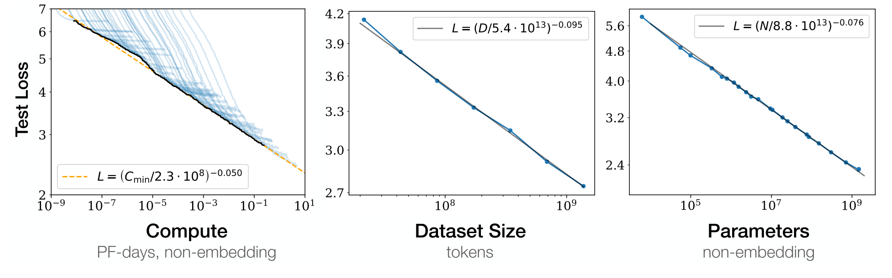

# Scaling Law of Scientific Machine Learning

SCALE Lab's publicatoin in this direction
- *Yiping Lu, Haoxuan Chen, Jianfeng Lu, Lexing Ying, Jose Blanchet* Machine Learning For Elliptic PDEs: Fast Rate Generalization Bound, Neural Scaling Law and Minimax Optimality *Tenth International Conference on Learning Representations(ICLR) 2022*
- *Yiping Lu, Jose Blanchet,Lexing Ying* Sobolev Acceleration and Statistical Optimality for Learning Elliptic Equations via Gradient Descent, *Thirty-sixth Conference on Neural Information Processing Systems (NeurIPS) 2022*
- *Honam Wong, Wendao Wu, Fanghui Liu, Yiping Lu*  	Physics-Informed Learning Interpolates Well in Fixed Dimension: Inductive Bias and Benign Overfitting, *Submitted*

## Scaling Law

The term “scaling laws” in deep learning refers to relations between functional properties of interest (usually the test loss or some performance metric for fine-tuning tasks) and properties of the architecture or optimization process (like model size, width, or training compute). These laws can help inform the design and training of deep learning models, as well as provide insights into their underlying principles.

## Statistical Model For Physics Informed Machine Learning

Physics-Informed Machine Learning (PIML) aims to solve equation \\(\mathcal{A}u=f\\) using observations of function \\(f\\).

