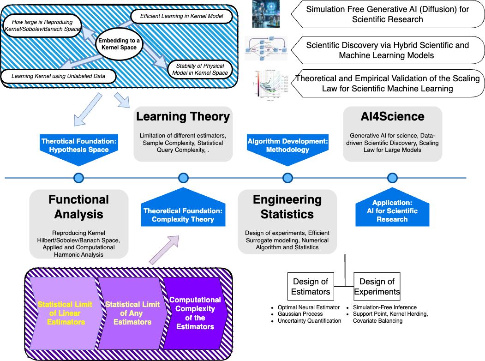

# Research

At SIGNAL group, we have a diverse and continuously expanding scope of research interests spanning the theoretical and algorithm development aspects of  the new generation of AI powered research paradigm that integrates scientific and engineering knowledge into Machine learning and Generative AI. Our team is dedicated to research at the intersection of machine learning, non-parametric statistics, applied probability, and numerical analysis. Our primary focus lies in developing algorithmic and theoretical foundations for modern domains such as `Deep Learning`, `Generative AI`, and `AI4Science`.

**Potential Topics:** Large Foundation Models for Science, Computational Complexity for Scientific Computing, Banach Space Geometry, Simulation Free (Diffusion) Models for Science, Trustworthy Machine Learning and Calibration

## Scaling Law of Scientific Machine Learning

How large the sample size and how much computational power are needed to reach a prescribed performance level for a physic problem? In machine learning, a neural scaling law (one of the secrete makes language model works) is a scaling law relating parameters of a family of neural networks. We are interested in how physics will affect the scaling law.

<a href="/posts/scalinglaw/">Read more <i class="fas fa-angle-double-right fa-fw"></i></a>

## Foundation of Machine Learning

Machine learning has achieved great success in many applications such as image recognition and language models. However, the reason why machine learning is so powerful remains elusive. One of the secrete behind this is machine learning provides powerful function/functional approximator in high dimension. Our group aims to understand the mysterious of machine learning using `functional analysis`, `high-dimensional statistics` and `high-dimensional probability`.

## Encoding Physics Information into a Model

Our research focus on interpreting many popular neural networks as different numerical discretizations of (stochastic) differential equations. Based on this perspective, we were able to combine physical information with the deep neural network architecture to boost the performance and transparency at the same time.

## Robust Machine Learning

Overparametraization, i.e, having more model parameters than necessary, is the core factor behind the success of modern machine learning. However, overparametraization also enables the model to fit any noisy signal which makes the model extremely vulnerable. Our research aims to build robust overparametrized model via understanding the inductive bias.

