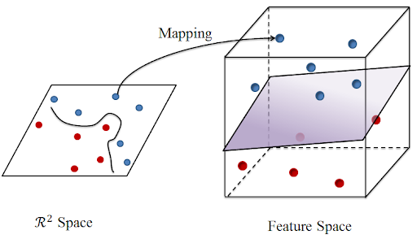

# Reproducing Kernel Hilbert Space and Reproducing Kernel Banach Space

This article introduces Reproducing Kernel Hilbert Space and Reproducing Kernel Banach Space.

## Reproducing Kernel Banach Space


:(far fa-bookmark fa-fw): A reproducing kernel Banach space \\( \mathcal{B} \\) on a prescribed nonempty set \\( X \\) is a Banach space of certain functions on \\( X \\) such that every point evaluation functional \\( \delta_x \\), \\( x \in X \\) on \\( \mathcal{B} \\) is continuous, that is, there exists a positive constant \\( C_x \\) such that
\\[ \left| \delta_x(f) \right| = \left| f(x) \right| \leq C_x \| f \|_\mathcal{B} \text{ for all } f \in \mathcal{B}. \\]


Note that in all Representer Kernel Banach Space \\( \mathcal{B} \\) on \\( X \\) norm-convergence implies pointwise convergence, that is, if \\( (f_n) \subset \mathcal{B}  \\) is a sequence converging to some \\( f \in  \mathcal{B}  \\) in the sense of \\( \|f_n - f\|_\mathcal{B} \rightarrow 0 \\), then \\( f_n(x) \rightarrow f(x) \\) for all \\( x \in X \\).

### Construction of Reproducing Kernel Banach Space


 For a Banach space $W$, let $\[\cdot,\cdot\]$  be its duality pairing which is a bi-linear maps from $W\times W' \rightarrow \mathbb{R}$. Suppose there exist an nonempty set \\( X \\) and a corresponding feature mappings $\Phi : X \rightarrow W',$.  We can  construct a Reproducing Kernel Banach Space as 
 \\[B := \\{ f_v(x) :=[\phi(x),v] : v \in W, x \in X \\} \\]
 
with norm \\(\|{f_v}\|_B := \text{inf} \\{\|v\|_W: v\in W\ \text{ with }\ f=[ \Phi(\cdot), v ]\\}.\\)


---

### Examples of RKBS

#### Neural Networks

> Bartolucci, Francesca, et al. "Understanding neural networks with reproducing kernel Banach spaces." Applied and Computational Harmonic Analysis.
> 
> Bartolucci, Francesca, et al. "Neural reproducing kernel Banach spaces and representer theorems for deep networks." arXiv:2403.08750 .

#### \\(L_p\\)-Type RKBS

---

## Representer Theorem 

> Unser, Michael. "A unifying representer theorem for inverse problems and machine learning." Foundations of Computational Mathematics 2021.

---

## Reproducing Kernel Hilbert Space

If a reproducing kernel Hilbert space \\(\mathcal{H}\\) is a Hilbert space (we have inner product structure), we call it a reproducing kernel Hilbert space.
- \\(\left<f,K(x,\cdot)\right>=f(x)\\), \\(K(x,y)=\left<K(x,\cdot),K(y,\cdot)\right>\\). This means \\(K_x:=K(x,\cdot)\\) is the feature map.
- Covaraince operator \\(\Sigma:=\mathbb{E}_x K_x\otimes K_x\\) where \\(x\otimes y=x y^\top\\) is the operator \\(\mathcal{H}\rightarrow\mathcal{H}\\) defined as \\(g\otimes h:f\rightarrow \left<f,h\right>g\\).


We definte the following operators \\(S:\mathcal{H}\rightarrow \mathcal{L}_2\\) as \\((Sg)(x)=\left<g,K_x\right>\\).


### Eigendecay and effective rank

### Reproducing Kernel Sobolev Space

## Characterization of Reproducing Kernel Banach Space using Metric Entropy

